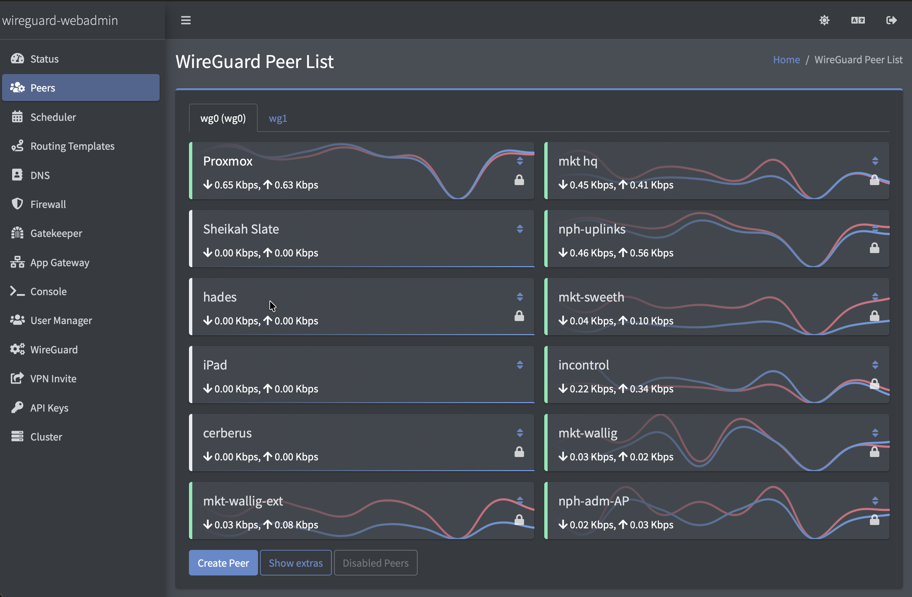
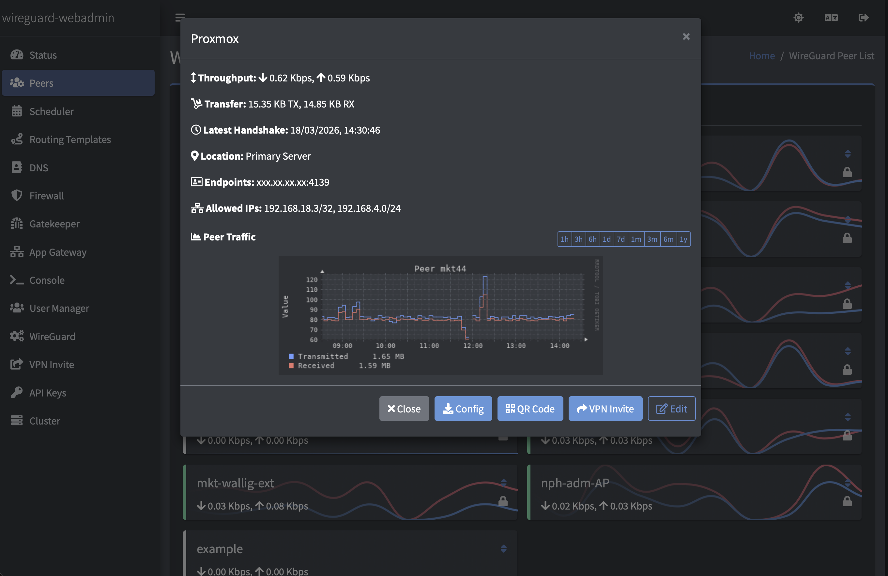
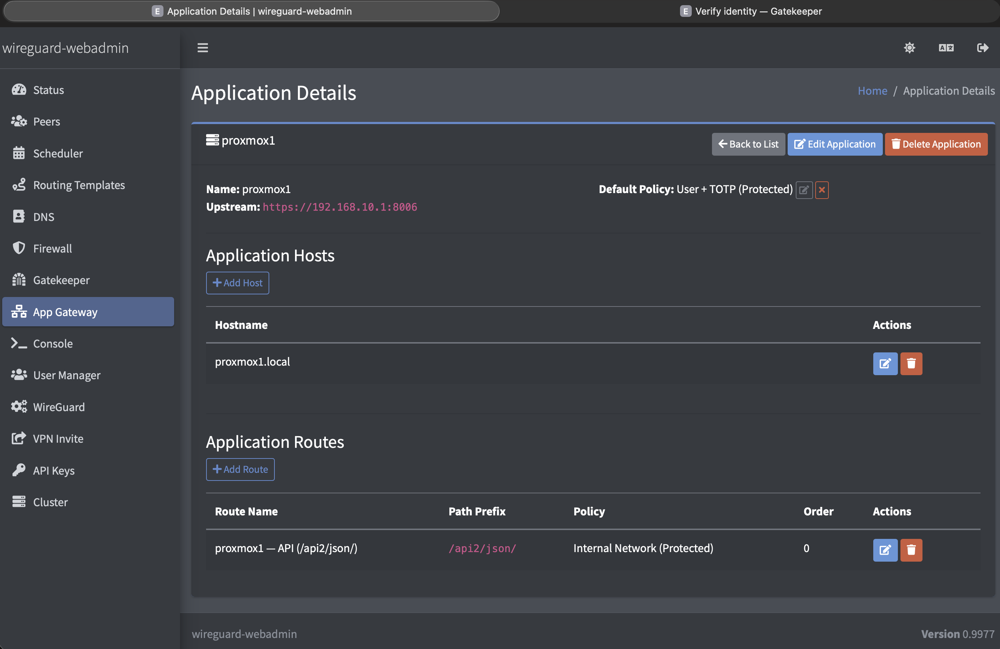
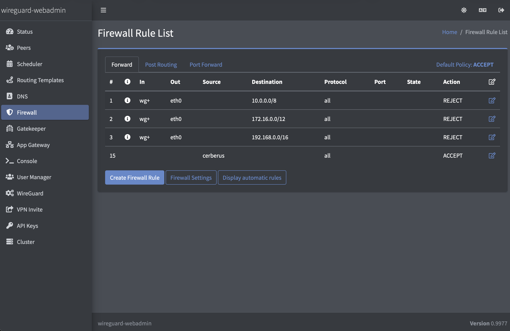
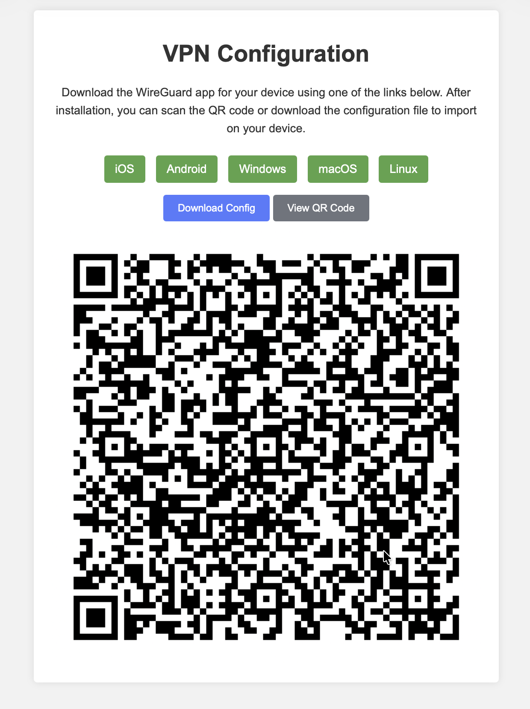

## 🌍 他の言語で読む
- 🇯🇵 [日本語](README.md)
- 🇬🇧 [English](https://github.com/eduardogsilva/wireguard_webadmin/blob/main/README.md)
- 🇧🇷 [Português](docs/README.pt-br.md)
- 🇪🇸 [Español](docs/README.es.md)
- 🇫🇷 [Français](docs/README.fr.md)
- 🇩🇪 [Deutsch](docs/README.de.md)

翻訳に問題がある場合や、新しい言語の追加を希望する場合は、[issue](https://github.com/pench999/wireguard_webadmin_ja/issues) からお知らせください。


# wireguard_webadmin 日本語版

**セルフホスト型の VPN 管理と Zero Trust アクセス制御を、すべて自分のインフラ上で運用できます。**

wireguard_webadmin は、単なる WireGuard 管理パネルではありません。ピア、ファイアウォールルール、DNS、ポート転送を管理でき、さらに認証付きで内部アプリケーションを公開できます。外部の第三者サービスに依存せず、Docker が動作する Linux マシンで利用できます。無料・オープンソースで、データは自分のサーバー内に留まります。

このリポジトリは [eduardogsilva/wireguard_webadmin](https://github.com/eduardogsilva/wireguard_webadmin) の UI 日本語化フォークです。

- ⚙️ **管理** - 複数の WireGuard インスタンス、ピア通信グラフ、ファイアウォール、DNS ブラックリスト、QR コード付き VPN 招待リンク
- 🔒 **保護** - TOTP、IP ACL、ブルートフォース対策 (Altcha PoW) を備えた Zero Trust アプリケーションゲートウェイ
- ⚡ **自動化** - ピアアクセスのスケジュール制御、ルーティングテンプレート、有効期限付き招待リンク、REST API v2

### 📖 詳細なドキュメント、インストール手順、設定のヒントは [wireguard-webadmin.com](https://wireguard-webadmin.com/) を参照してください

---

## クイックインストール

日本語版を利用する場合は、このフォークを clone して起動してください。

```bash
git clone https://github.com/pench999/wireguard_webadmin_ja.git wireguard_webadmin
cd wireguard_webadmin

cp .env.example .env
nano .env

docker compose -f docker-compose-caddy.yml up -d --build
```

`.env` の `SERVER_ADDRESS` は、利用者がアクセスするサーバーのIPアドレスまたはDNS名に変更してください。Caddyを使わず既存のリバースプロキシ配下で動かす場合は、`docker-compose-no-caddy.yml` を使います。

日本語版では、このリポジトリ内のソースコードから Docker イメージをビルドします。`--build` を付けずに起動すると、古いローカルイメージが再利用されて翻訳や修正が反映されない場合があります。

すでに起動済みの環境を日本語版へ更新する場合は、リポジトリを更新してからコンテナを再作成してください。

```bash
cd wireguard_webadmin
git pull
docker compose -f docker-compose-caddy.yml up -d --build --force-recreate
```

詳細な手順、アップグレードガイド、設定のヒントは **[wireguard-webadmin.com](https://wireguard-webadmin.com/)** を参照してください。

日本語版の運用補足として、[ピア管理マニュアル](docs/peer_management_ja.md)、[ピア管理マニュアル Word版](docs/peer_management_ja.docx)、[クライアントセットアップ手順書](docs/client_setup_ja.md)、[クライアントセットアップ手順書 Word版](docs/client_setup_ja.docx) も用意しています。

---

## スクリーンショット

### ピア一覧
すべての WireGuard インスタンスに登録されたピアのリアルタイム状態とライブ帯域グラフを確認できます。


### ピア詳細
通信履歴、最終ハンドシェイク、許可 IP、QR コードを 1 画面で確認できます。


### Zero Trust アプリケーションゲートウェイ
Proxmox や Grafana などの内部アプリケーションを、TOTP 認証付きで公開できます。直接ポートを開放する必要はありません。


### ファイアウォール管理
インスタンスごとの iptables ルール、ポート転送、アウトバウンド ACL を UI から管理できます。


### VPN 招待
QR コードと設定ファイルを含む共有用の招待を生成できます。ユーザーは WireGuard クライアントでスキャンまたはインポートするだけで利用できます。


---

## ライセンス

このプロジェクトは MIT License で公開されています。詳細は [LICENSE](LICENSE) を参照してください。

## コントリビューション

不具合報告、翻訳改善、プルリクエストは歓迎します。日本語化に関する issue や pull request は、このフォークの [GitHub リポジトリ](https://github.com/pench999/wireguard_webadmin_ja) へお願いします。
